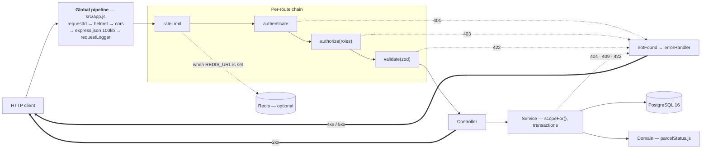
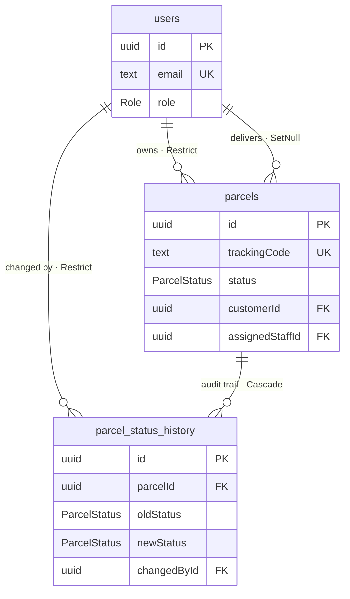
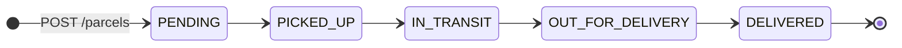
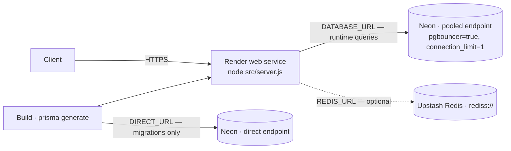

# ParcelFlow API — Architecture

Companion to [`README.md`](../README.md). The README explains how to run the service and documents
every endpoint with request and response examples; this document explains **why the code is shaped
the way it is**. Where the two overlap, the README wins on usage and this document wins on rationale.

Several source comments point here by section or by ADR number. Those references are load-bearing:

| Reference | Points at |
|---|---|
| `prisma/schema.prisma:3` | [§5 Data model](#5-data-model) |
| `src/middleware/authorize.js:7` | [ADR-009](#adr-009--authorization-is-two-questions-not-one) |
| `src/utils/response.js:2` | [ADR-011](#adr-011--one-response-envelope-for-every-endpoint) |
| `src/utils/password.js:5` | [ADR-012](#adr-012--bcryptjs-rather-than-native-bcrypt) |

## Contents

1. [Purpose and scope](#1-purpose-and-scope)
2. [System context](#2-system-context)
3. [Runtime architecture](#3-runtime-architecture)
4. [Request lifecycle](#4-request-lifecycle)
5. [Data model](#5-data-model)
6. [Domain rules](#6-domain-rules)
7. [Security model](#7-security-model)
8. [Operations](#8-operations)
9. [Deployment](#9-deployment)
10. [Architecture Decision Records](#10-architecture-decision-records)
11. [Trade-offs and roadmap](#11-trade-offs-and-roadmap)
12. [Related documents](#12-related-documents)

---

## 1. Purpose and scope

ParcelFlow is the backend for a parcel delivery operation. Three kinds of people use it and they
want different things from the same records:

- a **customer** books a parcel and wants to know where it is;
- a **delivery staff** member carries it and needs to record what happened to it;
- an **admin** runs the operation, assigns work, and wants numbers.

The service is a JSON REST API. It has no user interface, no email or SMS delivery, no payment
handling, and no geolocation. It does not attempt to be a general logistics platform — it models one
linear delivery pipeline and keeps an honest record of every move a parcel made.

The design goal that shaped most of the decisions below: **a parcel's history must be trustworthy.**
Anything that could produce a false, missing, or duplicated history row is treated as a correctness
bug rather than an edge case.

## 2. System context

```
     customers · delivery staff · admins
        (curl, Postman, any HTTP client)
                     │
                     │  HTTPS, JSON, Bearer tokens
                     ▼
             ┌───────────────┐
             │ ParcelFlow API│  Node 22 · Express 5
             └───────────────┘
                │         │
    Prisma      │         │   rate-limit counters
                ▼         ▼
        PostgreSQL 16   Redis (optional)
```

| Dependency | Required? | What happens without it |
|---|---|---|
| PostgreSQL 16 | Yes | The process still starts and `/health` still answers 200; every data route returns `503 DATABASE_UNAVAILABLE` |
| Redis | No | Rate-limit counters fall back to an in-memory store, which is correct for a single instance and wrong for several |

There is no message queue, no cache layer, and no second service. It is a modular monolith, which is
the right size for this problem — see [ADR-001](#adr-001--a-modular-monolith-in-layers).

## 3. Runtime architecture

Four layers, each allowed to know only about the one below it.

| Layer | Responsibility | Must not |
|---|---|---|
| **Routes** (`*.routes.js`) | Declare the middleware chain for each endpoint | Contain business logic |
| **Controllers** (`*.controller.js`) | Read `req.validated`, call one service function, choose the status code | Touch Prisma, or re-validate |
| **Services** (`*.service.js`) | Business rules, query scoping, transactions | Know about `req` or `res` |
| **Domain** (`domain/parcelStatus.js`) | The transition rules, as data | Import anything at all |

`src/utils/` and `src/lib/` sit outside the stack and are called from anywhere. `src/middleware/`
holds the cross-cutting concerns that routes compose.

### The global pipeline

`src/app.js` registers these for every request, in this order:

| # | | Why here |
|---|---|---|
| 1 | `app.disable('x-powered-by')` | Do not advertise the framework |
| 2 | `app.set('trust proxy', …)` | Decides how `req.ip` is derived behind a proxy — see [§7](#rate-limiting) |
| 3 | `requestId` | **First**, so that everything after it — including a failure in the body parser — can carry a correlation id |
| 4 | `helmet()` | Security headers |
| 5 | `cors()` | Currently open; see [§11](#11-trade-offs-and-roadmap) |
| 6 | `express.json({ limit: '100kb' })` | The cap is applied *during* parsing, so an oversized body is rejected without ever being buffered whole |
| 7 | `requestLogger` | After `requestId`, so every line is correlatable |
| 8 | `/`, `/health`, `/health/db` | Before the routers, so a health probe never touches auth |
| 9 | `/auth`, `/parcels`, `/admin` | The feature modules |
| 10 | `notFound` | Anything that matched no route becomes a 404 `ROUTE_NOT_FOUND` |
| 11 | `errorHandler` | Last. The only place in the codebase where an error becomes an HTTP response |

Per-route middleware is declared in each router rather than applied globally, so reading
`parcels.routes.js` tells you the whole chain for a route without cross-referencing. The one
exception is `admin.routes.js`, which calls `router.use(authenticate, authorize('ADMIN'))` once for
the whole file — deliberately, so a route added later cannot be left unprotected by accident.




## 4. Request lifecycle

`PATCH /parcels/:id/status` is the richest path in the codebase — it exercises authentication, both
authorization layers, the domain rules, optimistic concurrency, and the audit trail. The full
sequence diagram is [`diagrams/request-lifecycle.mmd`](diagrams/request-lifecycle.mmd). In prose:

1. **`requestId`** assigns `req.id` and echoes it as `X-Request-Id`.
2. **`authenticate`** splits the `Authorization` header, verifies the JWT with the algorithm and
   issuer pinned, then loads the user from the database. That lookup happens on *every* request, so a
   deleted account or a changed role takes effect immediately instead of whenever the token expires.
   Failures here are 401 with a specific code — `TOKEN_MISSING`, `TOKEN_EXPIRED`, `TOKEN_INVALID`,
   `USER_NOT_FOUND`.
3. **`authorize('DELIVERY_STAFF', 'ADMIN')`** asks whether this *role* may call this *endpoint*.
   Failure is 403.
4. **`validate`** parses `params` and `body` with Zod and writes the coerced, trimmed, defaulted
   result to `req.validated`. Failure is 422 with a per-field `details` array.
5. **The controller** reads `req.validated` and calls `parcelsService.updateStatus`.
6. **The service** computes `scopeFor(user)` and reads the parcel with that scope spread into the
   `WHERE` clause. No row means 404 — whether the parcel does not exist or simply is not this
   caller's, the answer is identical on purpose.
7. **The domain module** is asked whether the move is legal. An illegal move is 409
   `INVALID_STATUS_TRANSITION`, and the response names the current status, the requested one, and
   what would have been allowed.
8. **A transaction** runs a conditional `UPDATE … WHERE id = ? AND status = <the value just read>`.
   If another request moved the parcel first, zero rows match, the transaction rolls back, and the
   loser gets 409 `STATUS_CONFLICT` rather than writing a second history row. On success the history
   row is inserted inside the same transaction.
9. **`requestLogger`** writes one JSON line on `res.on('finish')` with the request id, method, path,
   status, duration and user id.

Everything that throws — at any depth, including a rejected promise, which Express 5 forwards
automatically — lands in `errorHandler`, which is the single place that turns an error into a
response.

## 5. Data model

Three tables, two enums, and seven indexes. This section is what `prisma/schema.prisma:3` points at:
every field and every index, with the reason it exists.



### `users`

| Field | Type | Why |
|---|---|---|
| `id` | `uuid(7)` PK | UUID **v7** rather than v4: v7 embeds a timestamp in its high bits, so generated ids sort roughly by creation time and inserts land at the tail of the primary-key index instead of scattering across it. A v4 primary key fragments the index on a write-heavy table |
| `name` | `text` | Display name. Returned by every endpoint that expands a relation |
| `email` | `text` UNIQUE | The login identity. Normalised to lowercase and trimmed *before* validation, so `Alice@Example.com ` and `alice@example.com` resolve to one account. The uniqueness is enforced by the constraint, not by an application check |
| `password` | `text` | A bcrypt hash. Selected by exactly one query in the codebase — `login()` — and stripped from the object before it is returned |
| `role` | `Role` enum, default `CUSTOMER` | The default matters: it is the second of two layers preventing self-registration as an admin |
| `createdAt` | `timestamp` | Also the default sort key for `GET /admin/users` |

### `parcels`

| Field | Type | Why |
|---|---|---|
| `id` | `uuid(7)` PK | As above |
| `trackingCode` | `text` UNIQUE | The public handle. The unique constraint *is* the uniqueness guarantee — see [ADR-015](#adr-015--tracking-codes-are-random-and-uniqueness-is-the-databases-job) |
| `senderName`, `receiverName` | `text` | Free text. Deliberately **not** foreign keys: the receiver is usually not a registered user, and the sender's name on the label should not silently change when an account is renamed |
| `pickupArea` | `text` | Filterable |
| `deliveryArea` | `text` | Filterable, and the grouping key for `topDeliveryAreas` in the admin stats |
| `parcelType` | `text` | Free text rather than an enum: the set of things people ship is open-ended, and a new category should not need a migration |
| `status` | `ParcelStatus` enum, default `PENDING` | The database can enforce that the value is one of five. It cannot enforce which moves are legal — see [ADR-010](#adr-010--transition-rules-live-in-code-as-data-not-in-the-database) |
| `customerId` | `uuid` FK → `users`, `onDelete: Restrict` | The owner. `Restrict` because a parcel must never become ownerless; deleting a customer with parcels should fail loudly |
| `assignedStaffId` | `uuid?` FK → `users`, `onDelete: SetNull` | Null until an admin assigns someone. `SetNull` rather than `Restrict` because removing a staff member should *release* their parcels, not block the deletion — the parcels are still real and still need delivering |
| `createdAt` | `timestamp` | Default sort key, and the baseline for the average-delivery-time calculation |
| `updatedAt` | `timestamp` `@updatedAt` | Maintained by Prisma; available as a sort key |

### `parcel_status_history`

Append-only. Nothing in the codebase updates or deletes a row here — verified: there is no
`.delete(` or `.update(` against this model anywhere.

| Field | Type | Why |
|---|---|---|
| `id` | `uuid(7)` PK | |
| `parcelId` | `uuid` FK → `parcels`, `onDelete: Cascade` | `Cascade` because a history row has no meaning once its parcel is gone |
| `oldStatus` | `ParcelStatus?` | Null on **exactly one row per parcel** — the creation record, which represents *nothing → PENDING*. That nullability is what makes the trail self-describing: you can find the birth of a parcel without joining anything |
| `newStatus` | `ParcelStatus` | |
| `changedById` | `uuid` FK → `users`, `onDelete: Restrict` | Who did it. `Restrict`, not `SetNull` — an audit trail that forgets who acted is not an audit trail. Deleting a user who has ever changed a status must fail |
| `createdAt` | `timestamp` | When it happened. Ordering key |

### Indexes

| Index | Serves |
|---|---|
| `users_email_key` (unique) | Login, and the duplicate-email check on registration |
| `parcels_trackingCode_key` (unique) | Tracking lookups, and the collision detection behind tracking-code generation |
| `parcels_status_idx` | `?status=` filtering, and the `groupBy(status)` in `/admin/stats` |
| `parcels_deliveryArea_idx` | `?deliveryArea=` filtering, and the `topDeliveryAreas` grouping |
| `parcels_customerId_idx` | `scopeFor()` for every `CUSTOMER` — their own list |
| `parcels_assignedStaffId_idx` | `scopeFor()` for every `DELIVERY_STAFF` — their work queue, and the unassigned-parcel count |
| `parcel_status_history_parcelId_createdAt_idx` (composite) | Fetching one parcel's history in order. The composite covers both the filter and the sort, so the ordered read is served entirely by the index |

The four `parcels` indexes are not decoration: each one backs a query that runs on a normal page
load. `pickupArea` is filterable through the API but is **not** indexed — it is the rarer filter, and
an index costs write throughput on every insert and update. That is a deliberate trade, and the
right thing to revisit if pickup-area filtering ever becomes common.

## 6. Domain rules

`src/domain/parcelStatus.js` imports nothing. Not Prisma, not Express, not the config. That is the
whole point: the transition rules can be reasoned about, and eventually tested, without a database,
a server, or a single mock.

The flow is strictly linear:



Five states admit 25 ordered pairs. Exactly **four** are legal. Everything else — skipping a step,
going backwards, or setting a parcel to the status it already has — is rejected. Same-to-same is
rejected rather than treated as a harmless no-op, because accepting it would write a meaningless row
into the audit trail, and the trail is the thing being protected.

The rules are a frozen object, `TRANSITIONS`. Adding a sixth status means editing that object and
the Prisma enum; no service code changes. `explainTransition()` returns not just a rejection but a
message naming the current status, the requested one, and the legal next step, which is what the 409
body carries.

## 7. Security model

### Authentication

Stateless JWT. `signToken` pins **HS256**, sets `subject` to the user id, sets an `issuer` of
`parcelflow-api`, and includes the role as a convenience claim. `verifyToken` pins the algorithm
list and checks the issuer — pinning the algorithm is what closes the `alg: none` and
algorithm-confusion family of attacks, where an attacker re-signs a token with a different algorithm
and a key the verifier will accept.

The role claim in the token is **not** trusted for authorization. `authenticate` re-reads the user
from the database on every request and uses that row. The consequence is worth stating plainly:
demoting or deleting an account takes effect on the very next request, not when the token expires.
The cost is one indexed primary-key lookup per request, which is the cheapest query the database can
answer.

There is no refresh token, no logout, and no revocation list. A token is valid until
`JWT_EXPIRES_IN` elapses (default `1d`) — with the caveat above, that the underlying account is
re-checked every time.

### Authorization — two questions, two places

This is [ADR-009](#adr-009--authorization-is-two-questions-not-one) and it is the decision most
worth understanding:

| Question | Where | Failure |
|---|---|---|
| May this **role** call this **endpoint**? | `authorize()` middleware | **403** |
| Which **records** may this **caller** see? | `scopeFor()` inside the service | **404** |

`scopeFor()` returns a `WHERE` fragment — `{ customerId: user.id }` for a customer,
`{ assignedStaffId: user.id }` for staff, `{}` for an admin, and `{ id: { in: [] } }` for an
unrecognised role, which matches nothing and fails closed. It is spread into every read.

There is no post-fetch ownership check anywhere in the codebase, because a row outside the caller's
scope never leaves the database. This is also why someone else's parcel returns **404 and not 403**:
a 403 would confirm that the parcel exists, which is itself a disclosure.

### Privilege escalation

Registration cannot produce an admin, and this is enforced twice:

1. `registerSchema` is a Zod `strictObject`, so an unexpected `role` key is a **422**, not a silently
   dropped field.
2. `authService.register` hard-codes `role: 'CUSTOMER'` regardless of input.

Staff and admin accounts come from the seed script or from an existing admin calling
`PATCH /admin/users/:id/role`. That endpoint refuses to act on the caller's own id, which is what
stops the last remaining admin from demoting themselves and locking everyone out.

### Account enumeration

`POST /auth/login` is careful about it. An unknown email and a wrong password return the same 401
with the same `INVALID_CREDENTIALS` code, and the unknown-email path runs a bcrypt comparison against
a dummy hash so that both paths take roughly the same time. Without that dummy compare the unknown
path would return in microseconds against the ~100 ms a real comparison costs, and the timing
difference alone would answer the question.

`POST /auth/register` does not have the same property. It is unthrottled, and it returns a distinct
`409 EMAIL_TAKEN` when an address is already registered. An attacker who wants to know whether an
address has an account can ask there instead. Closing this is a roadmap item — see
[§11](#11-trade-offs-and-roadmap).

### Passwords

Hashed with `bcryptjs` at a cost factor from `BCRYPT_ROUNDS` (default 10, constrained to 4–15 so a
typo cannot silently produce a useless hash). The schema caps a password at **72 bytes** because
bcrypt hashes only the first 72 and silently ignores the rest — without the cap, two different long
passwords could unlock the same account.

There is currently **no minimum length** on registration: the schema requires only that a password be
present. Enforcing a floor is a roadmap item.

### Input handling

Every route validates `params`, `query` and `body` with Zod `strictObject` schemas, and the parsed
result is written to `req.validated`. Services and controllers read only from there and never from
the raw request, so everything downstream of validation is already coerced, trimmed and defaulted.
Unknown keys are rejected rather than ignored. Request bodies are capped at 100 kb during parsing.

Prisma parameterises every query it builds. The single raw SQL statement in the codebase — the
average-delivery-time aggregate in `admin.service.js` — is a static template literal with no
interpolated values at all.

No endpoint returns a password hash. Every `select` in the codebase was traced to confirm it: the
shared `publicUserSelect` omits the field, `parcelSelect` trims relations to id and name (plus email on
`assignedStaff`, so a customer can reach their courier), and `login()` — the one query that must read the
hash — destructures it away before returning.

### Rate limiting

Two limiters, both configurable:

| Limiter | Applies to | Default |
|---|---|---|
| `loginLimiter` | `POST /auth/login` | 10 attempts per 15 minutes |
| `trackingLimiter` | `GET /parcels/:trackingCode` | 60 lookups per minute |

The login limiter runs **before** validation, so a guessing loop is rejected before the server spends
anything parsing its body. Counters live in Redis when `REDIS_URL` is set, so several instances share
one budget; otherwise they are in-process.

Three properties of the current configuration are worth stating precisely, because they bound how
much protection the limiter actually provides:

- The bucket key is taken from the `cf-connecting-ip` request header when present, falling back to
  `req.ip`. A request header is supplied by the client.
- `trust proxy` is set to `3` in production. With a numeric value, Express walks `X-Forwarded-For`
  from the right and trusts that many hops before taking the next address as `req.ip`.
- `passOnStoreError: true` means that if the Redis store errors, the request is allowed through
  rather than rejected. There is no in-memory fallback on that path.

Together these mean the limiter is a **speed bump against casual abuse rather than a hard control**.
Tightening all three is the first item on the roadmap.

### Secrets and headers

`.env` is gitignored and `.env.example` carries no real values. `JWT_SECRET` must be at least 32
characters or the process refuses to start. The logger is never passed a token or a password —
callers log identifiers. `helmet()` sets the standard security headers and `x-powered-by` is
disabled. Stack traces are attached to 5xx responses only outside production.

## 8. Operations

### Configuration

Every environment variable is declared in one Zod schema in `src/config/env.js` and parsed at import
time. A missing `JWT_SECRET` or a malformed `PORT` prints the offending variable name and exits 1 —
the process refuses to start rather than boot into a state where it signs tokens with `undefined`.
The parsed object is frozen and exported; nothing else in the codebase reads `process.env` directly.

Outside production the file is loaded with Node 22's built-in `process.loadEnvFile()`, which is why
there is no `dotenv` dependency. In production the file is skipped entirely, because hosting
platforms inject variables directly and a stale committed file would silently win.

### Logging and correlation

`src/lib/logger.js` writes JSON lines — one object per event, machine-parseable — to stdout, or
stderr for errors. It is silent when `NODE_ENV=test` so a test runner's output stays readable.

`requestId` assigns a UUID to every request before anything can fail and echoes it as the
`X-Request-Id` response header. A client-supplied id is honoured when it matches
`/^[A-Za-z0-9._-]{1,128}$/`, which lets a caller correlate a request across systems while keeping
arbitrary content out of the logs. Every error response carries the same id in its body, so a failure
a user reports can be found in the logs by exact match.

### Health checks

| Endpoint | Touches the database? | Purpose |
|---|---|---|
| `GET /health` | No | Liveness. An uptime monitor can hit it every 30 seconds forever without costing a connection |
| `GET /health/db` | Yes | Readiness. Runs `SELECT 1` and returns `503 DATABASE_UNAVAILABLE` when the database is unreachable |

The split exists because those are genuinely different questions, and conflating them means either
an expensive liveness probe or a readiness probe that lies.

### Error handling

`errorHandler` is the only place an error becomes a response. It normalises everything into one
`AppError`: body-parser failures become `INVALID_JSON` / `PAYLOAD_TOO_LARGE`, Prisma's known error
codes are translated (`P2002` → 409 duplicate, `P2025` → 404, `P2003` → 422 bad reference), and a
`PrismaClientInitializationError` becomes **503**, not 500 — the process is healthy, its database is
not, and 503 tells a proxy to retry where a 500 says stop asking.

Anything unrecognised becomes a generic 500 whose message never varies, with the real message and
stack going to the logs instead of to the client.

Express 5 forwards rejected promises to the error handler automatically, which is why no route
handler in this codebase is wrapped in a try/catch or an async wrapper.

### Graceful shutdown

On `SIGTERM` or `SIGINT`, `server.js` stops accepting new connections, lets in-flight requests
finish, disconnects the Prisma pool, and exits. A 10-second `unref`'d timer guarantees the process
dies even if a connection hangs.

### Stack check

`npm run check` verifies the whole stack in one command — Docker daemon, both containers, the port,
the process, the database, a real login, and an authenticated read. It creates nothing, exits 0 when
everything passes, and prints the fixing command next to whatever failed.

## 9. Deployment

Render runs a single web service. Node is pinned to 22.18.0 in `.node-version` — the application
depends on Node 22 APIs (`process.loadEnvFile`), so the version is a hard requirement rather than a
preference.



Two things about this topology are not obvious:

**Two database URLs, deliberately.** Neon's pooled endpoint runs pgBouncer in transaction mode,
which cannot execute DDL. Migrations therefore go to `DIRECT_URL` while every runtime query goes
through the pooler on `DATABASE_URL`. This is what `directUrl` in the Prisma datasource is for.

**Two Prisma binary targets.** `binaryTargets = ["native", "debian-openssl-3.0.x"]` builds the query
engine both for the developer's machine and for the Debian-based container the platform builds in.
Without the second target the engine compiled at build time does not match the runtime image.

The pooled connection string sets `connection_limit=1`. That keeps a free-tier instance from
exhausting Neon's connection budget, and it is worth knowing that it also serialises interactive
transactions in the process — see [§11](#11-trade-offs-and-roadmap).

Nothing proxies in front of Render: there is no CDN, no WAF, and no Cloudflare layer.

## 10. Architecture Decision Records

Each record states the situation, the choice, and what the choice costs. They are numbered
permanently — three of them are cited by number from source comments.

### ADR-001 — A modular monolith, in layers

**Context.** Three resources, three roles, one team.
**Decision.** One deployable, organised as `modules/<feature>/{routes,controller,service,schemas}`
with a shared `middleware/`, `utils/` and a dependency-free `domain/`.
**Consequence.** A feature is one directory, so it can be read or removed in one place. Services are
plain functions, so extracting one later is mechanical. The cost is that nothing forces the layering
— it is a convention the code follows, not something the compiler checks.

### ADR-002 — `createApp()` is separate from `listen()`

**Context.** An app that binds a port on import cannot be driven by a test without a real socket.
**Decision.** `app.js` exports `createApp()` and builds the app; `server.js` is the only file that
calls `listen()`.
**Consequence.** A test can import the app and drive it in-process with supertest. Graceful shutdown
has one obvious home. No cost worth naming.

### ADR-003 — Node 22's native `.env` loading, not `dotenv`

**Context.** `dotenv` is a dependency that exists to read a file Node can now read itself.
**Decision.** `process.loadEnvFile()`, called only outside production.
**Consequence.** One fewer dependency, and production cannot be confused by a stale file. The cost is
a hard floor of Node 22, which is why the version is pinned rather than suggested.

### ADR-004 — Validate at the boundary, into `req.validated`

**Context.** Express 5 made `req.query` a read-only getter, so the familiar trick of overwriting it
with parsed values no longer works.
**Decision.** `validate()` parses `params`, `query` and `body` and writes the results to
`req.validated`. Controllers and services read only from there.
**Consequence.** Every value downstream of validation is already coerced, trimmed and defaulted, and
the raw request stays untouched and inspectable. The cost is one more property to remember.

### ADR-005 — Fail fast on bad configuration

**Context.** A missing secret that surfaces as a runtime error is discovered by a user, not by a
deploy.
**Decision.** Parse the whole environment with Zod at import time; print the offending variable and
`exit(1)` on failure.
**Consequence.** Misconfiguration is a startup failure, which a deploy notices. The cost is that the
config module has an import-time side effect.

### ADR-006 — One Prisma client for the process

**Context.** Prisma manages its own connection pool.
**Decision.** A single exported instance in `lib/prisma.js`.
**Consequence.** Connections are bounded and reused. A client per request would exhaust the database
immediately.

### ADR-007 — Stateless JWT, with the user re-read every request

**Context.** Stateless tokens are cheap but stale; server-side sessions are fresh but need storage.
**Decision.** Sign a JWT with HS256 and the issuer pinned, and have `authenticate` load the user from
the database on every request rather than trusting the claims.
**Consequence.** A deleted account or a changed role takes effect on the next request. There is still
no revocation for the token itself. The cost is one indexed primary-key lookup per request, which is
the cheapest read the database offers.

### ADR-008 — Registration cannot choose a role

**Context.** `POST /auth/register` is unauthenticated. If it reads `role` from the body, it is an
admin-account factory.
**Decision.** Two layers: the Zod schema is a `strictObject` so `role` is a 422, and the service
hard-codes `CUSTOMER` anyway.
**Consequence.** Neither layer alone is load-bearing, which is the point. Privileged accounts come
only from the seed or from an existing admin.

### ADR-009 — Authorization is two questions, not one

*Cited by `src/middleware/authorize.js:7`.*

**Context.** "May a customer call this endpoint?" and "may this customer see this parcel?" get
conflated into one permission check, and the result is either a leak or a mess.
**Decision.** Separate them. Role gating is middleware and answers **403**. Record visibility is a
`WHERE` fragment from `scopeFor()` inside the service and answers **404**.
**Consequence.** Ownership is enforced in the query, so an out-of-scope row never leaves the
database and there is no post-fetch check to forget. Someone else's parcel is indistinguishable from
one that does not exist, which is the correct disclosure. The cost is that visibility rules live in
the services rather than in one central policy file.

### ADR-010 — Transition rules live in code, as data, not in the database

**Context.** A Postgres enum can constrain a column to five values. It cannot express that `PENDING`
may only become `PICKED_UP`.
**Decision.** A frozen `TRANSITIONS` object in a module that imports nothing.
**Consequence.** The rules are one readable object, changing them is a one-line edit, and they can be
tested without a database or a mock. The cost is that the constraint is not enforced by the database,
so a direct SQL write could still violate it.

### ADR-011 — One response envelope for every endpoint

*Cited by `src/utils/response.js:2`.*

**Context.** Clients that must branch on response shape per endpoint accumulate special cases.
**Decision.** Success is always `{ success: true, data, meta? }`; failure is always
`{ success: false, error: { code, message, details?, requestId } }`. `meta` appears only on list
endpoints. `code` is a stable machine-readable identifier; `message` is for humans and may be
reworded.
**Consequence.** One parser handles every response, and clients branch on `code`. The cost is a
little verbosity on trivial responses.

### ADR-012 — `bcryptjs` rather than native `bcrypt`

*Cited by `src/utils/password.js:5`.*

**Context.** The native `bcrypt` package needs a C++ toolchain at install time, which is exactly what
free-tier build containers tend not to have.
**Decision.** `bcryptjs`, a pure-JavaScript implementation, with the cost factor supplied by
configuration.
**Consequence.** The build has no native step to fail, and tests can lower the cost while production
raises it, without a code change. The cost is real: pure JS is meaningfully slower than the native
binding, which matters at high login volume and is entirely acceptable here.

### ADR-013 — History is written in the same transaction as the change

**Context.** If a status change commits and its history row fails, the audit trail is silently wrong.
**Decision.** Parcel creation writes the parcel and its first history row (`null → PENDING`) in one
transaction; every status change writes the update and the history row in one transaction.
**Consequence.** The trail is complete from the first event and can never disagree with the parcel.

### ADR-014 — Optimistic concurrency on status changes

**Context.** Two staff members advancing the same parcel at once both read the same status, both pass
validation, and both write a history row.
**Decision.** The `UPDATE` is conditional on the status still being the value that was just read. Zero
rows matched means someone else won; the transaction rolls back and the loser receives 409
`STATUS_CONFLICT`.
**Consequence.** No lost update and no duplicated history, without holding a lock. The cost is that
the loser must retry.

### ADR-015 — Tracking codes are random, and uniqueness is the database's job

**Context.** `Math.random()` is seeded from predictable state, and predictable codes let someone
enumerate other people's parcels. Separately, checking for a code and then inserting it is a race.
**Decision.** Generate from `crypto.randomInt` over an alphabet with the ambiguous characters
(`I`, `L`, `O`, `0`, `1`) removed, insert, and let the `UNIQUE` constraint detect a collision. Retry
on `P2002` up to five times.
**Consequence.** Codes are unguessable and unambiguous when read aloud or typed off a label, and
uniqueness is guaranteed by the database rather than hoped for by the application.

### ADR-016 — Rate limiting with a Redis store and an in-memory fallback

**Context.** In-memory counters are per-process, so with several instances the real limit is the
configured limit times the instance count.
**Decision.** Use a Redis store when `REDIS_URL` is set, and an in-memory store when it is not.
**Consequence.** A single instance needs no infrastructure; several instances share one budget by
setting one variable. See [§7](#rate-limiting) for the current limits of this mechanism.

### ADR-017 — A correlation id on every request and every error

**Context.** "It failed" is not a reproducible report.
**Decision.** `requestId` runs first, echoes `X-Request-Id`, and every error body carries the same id.
**Consequence.** A reported failure is one exact-match log search away.

### ADR-018 — Liveness and readiness are different endpoints

**Context.** A health check that queries the database costs a connection on every poll; one that does
not cannot detect a dead database.
**Decision.** `/health` is shallow, `/health/db` is deep and returns 503.
**Consequence.** Uptime monitoring is free, and deploy gating is accurate.

### ADR-019 — Pooled and direct database URLs

**Context.** Neon's pooled endpoint runs pgBouncer in transaction mode, which cannot run DDL.
**Decision.** `DATABASE_URL` (pooled) for runtime, `DIRECT_URL` (direct) for migrations.
**Consequence.** Migrations work and runtime connections stay pooled. The cost is two connection
strings to keep in step.

### ADR-020 — Graceful shutdown with a hard deadline

**Context.** A platform sends `SIGTERM` and then kills the process; requests in flight are lost.
**Decision.** Stop accepting connections, drain, disconnect Prisma, exit — with a 10-second timer
that forces the exit regardless.
**Consequence.** Deploys do not sever live requests, and a hung connection cannot wedge the process.

## 11. Trade-offs and roadmap

Listed in the order they would be worth doing.

### 1. Harden rate limiting

Three properties described in [§7](#rate-limiting) each reduce what the limiter guarantees: the
bucket key can come from a client-supplied header, `trust proxy: 3` is more permissive than the
single hop this deployment actually has, and a store error lets the request through. The fix is
small — key on the platform-resolved client IP, set the hop count to what Render actually adds, and
fall back to the in-memory store instead of failing open — and it turns the limiter from a speed
bump into a control.

### 2. Registration hardening

`POST /auth/register` needs a rate limiter and a minimum password length. Returning a generic
success-shaped response for an already-registered address, and confirming ownership out of band,
would close the enumeration path that login carefully avoids.

### 3. Automated tests

The harness is already in place and unused: `createApp()` is split from `listen()` precisely so a
test can drive it, `supertest` is installed, `TEST_DATABASE_URL` is wired through the config, the
Docker init script creates the separate test database, and the rate limiters skip themselves when
`NODE_ENV=test`. What is missing is the test files and an `npm test` script. The highest-value
targets, in order: the transition table in `domain/parcelStatus.js` (pure, no database needed);
`scopeFor()` visibility for each role; the 409 race in `updateStatus`; and the register/login
enumeration behaviour.

### 4. Two races in `assignStaff`

`assignStaff` reads the parcel's status and the target user's role, then writes — in three separate
statements with nothing holding them together. Between the read and the write, a staff member can be
demoted (leaving a parcel assigned to a non-staff user, since the demotion's cleanup only releases
parcels *already* assigned) or the parcel can be delivered (bypassing the "a delivered parcel cannot
be reassigned" guard). Both are fixed by the pattern `updateStatus` already uses: make the `UPDATE`
conditional on what was read.

### 5. Error-code consistency

`USER_NOT_FOUND` is returned with 401 from `authenticate` and with 404 from `admin.service`. The
README tells clients to branch on `code` rather than `message`, so one code meaning two things is a
genuine ambiguity. Either give them distinct codes or give them one status.

### 6. Smaller sharp edges

- `GET /parcels/<uuid>` falls through to the `/:trackingCode` route and returns 422 rather than 404,
  because ids and tracking codes share a path position. Either accept both formats or give ids their
  own path.
- `trackingLimiter` runs before `authenticate`, so an unauthenticated request still consumes quota
  for its IP.
- When tracking-code generation exhausts its five attempts, the raw `P2002` surfaces as
  `409 DUPLICATE`, which blames the client for a value the client never sent. The dedicated
  `TRACKING_CODE_GENERATION_FAILED` branch below the loop is unreachable.
- `updateStatus` runs a three-statement interactive transaction over a pool configured with
  `connection_limit=1`, so contention appears as a connection timeout and a generic 500 rather than
  as a clear conflict.
- `cors()` is currently open to every origin. That is right for a public API and wrong the moment a
  browser client sends credentials.

### 7. Scope not yet built

Cursor-based pagination for large result sets (offset pagination degrades as pages get deep);
refresh tokens and logout; `DELETE` or archive endpoints, of which there are currently none — the
API is fifteen endpoints and none of them removes anything; CI, an application `Dockerfile`, and a
committed deploy configuration.

## 12. Related documents

| | |
|---|---|
| [`README.md`](../README.md) | Setup, environment variables, and the full endpoint reference with examples |
| [`ParcelFlow.postman_collection.json`](../ParcelFlow.postman_collection.json) | 23 saved requests, including the ones that are supposed to fail |
| [`diagrams/`](diagrams/) | The six diagrams as Mermaid source |
| `prisma/schema.prisma` | The schema itself, annotated |
| `scripts/check.sh` | The stack health check behind `npm run check` |
